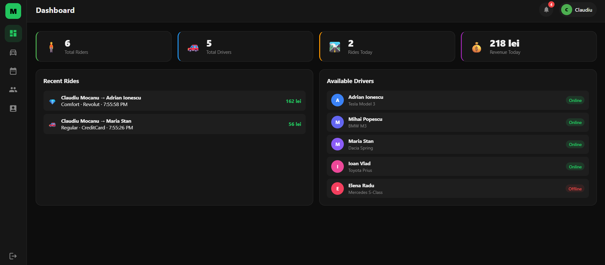
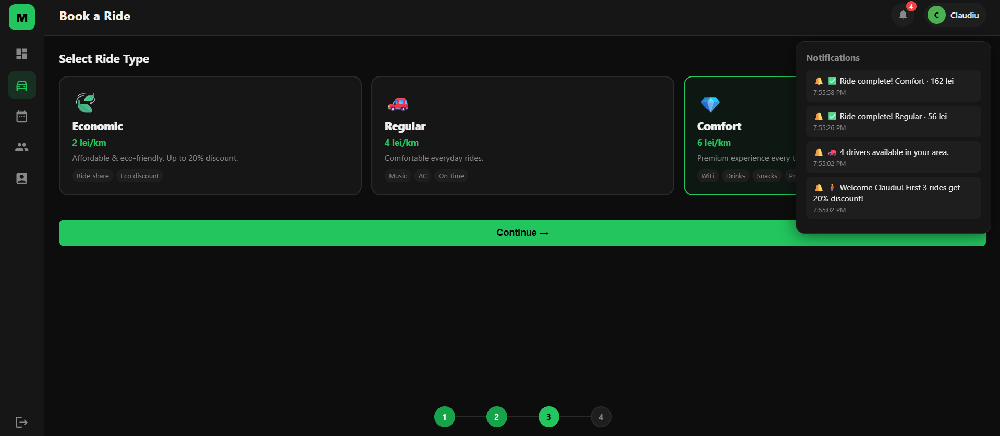
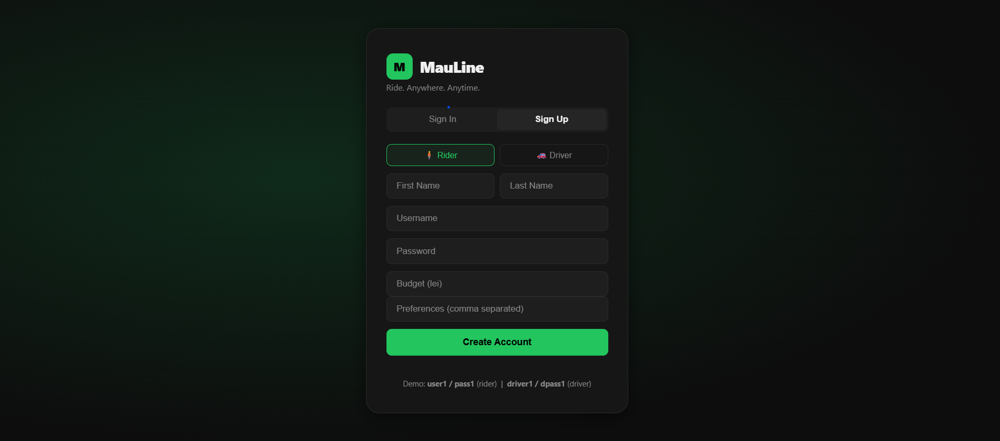
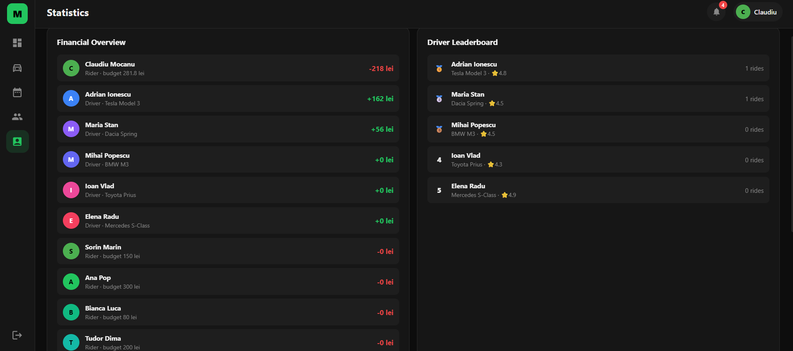
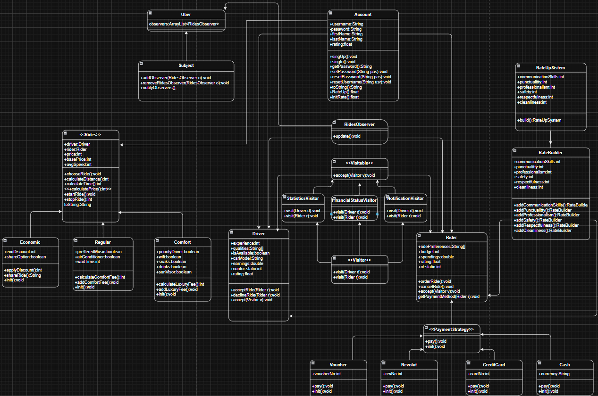

# MauLine – Ride Sharing Simulation

A complete **Uber-like system** built in Java, demonstrating advanced OOP principles and four design patterns through a fully interactive web UI.


> **Dashboard** — real-time stats, available drivers, and recent ride history. The Observer Pattern keeps all riders and drivers notified of activity in their area.

---

## Features

- Book rides in a guided 4-step flow
- Three ride types with dynamic pricing (Economic / Regular / Comfort)
- Four payment methods switchable at runtime
- Post-ride rating system across 6 criteria
- Financial statistics and driver leaderboard
- JSON-based data initialization + JUnit test suite

---

## Booking a Ride


> **Ride Selection** — the **Strategy Pattern** in action. The payment method is selected at runtime without changing any ride logic. Each ride type (`Economic`, `Regular`, `Comfort`) is a subclass of the abstract `Rides` class — **Polymorphism** at work.

| Type | Base | Per km | Extras |
|------|------|--------|--------|
| 🍃 Economic | 10 lei | 2 lei/km | Eco discount, ride-share |
| 🚗 Regular | 15 lei | 4 lei/km | Music, AC, wait-time fee |
| 💎 Comfort | 30 lei | 6 lei/km | WiFi, drinks, snacks, priority |

**Payment methods (Strategy Pattern):** Cash · Credit Card · Revolut · Voucher

---

## Authentication


> **Sign Up / Sign In** — both `Rider` and `Driver` extend the abstract `Account` class (**Inheritance**). Common behaviour (`signUp`, `signIn`, `changePassword`) lives in the base class; each subclass adds its own fields and logic (**Encapsulation**).

---

## Statistics


> **Statistics page** — powered by the **Visitor Pattern**. Three visitors (`FinancialStatsVisitor`, `StatisticsVisitor`, `NotificationVisitor`) traverse riders and drivers to generate reports without modifying the entity classes (**Open/Closed Principle**).

---

## Design Patterns

| Pattern | Where | Purpose |
|---------|-------|---------|
| **Strategy** | `PaymentStrategy/` | Swap payment method at runtime |
| **Observer** | `Observer/` | Notify riders & drivers of nearby activity |
| **Visitor** | `Visitor/` | Generate stats & notifications without touching entities |
| **Builder** | `RateUpSystem/` | Construct rating objects step-by-step across 6 criteria |

---

## OOP Concepts

| Concept | Example in project |
|---------|-------------------|
| **Inheritance** | `Driver` and `Rider` extend `Account` |
| **Polymorphism** | `Economic`, `Regular`, `Comfort` are used through the `Rides` interface |
| **Encapsulation** | All fields private; exposed via getters/setters |
| **Abstraction** | `Rides`, `PaymentStrategy`, `Subject`, `Visitor` are interfaces/abstract classes |

---

## Project Structure

```
src/
├── Entitati/          Account, Driver, Rider
├── Rides/             Economic, Regular, Comfort
├── PaymentStrategy/   Cash, CreditCard, Revolut, Voucher
├── Observer/          Subject, RidesObserver
├── Visitor/           3 concrete visitors
├── RateUpSystem/      Builder-based rating
├── Exceptions/        5 custom payment exceptions
└── MauLine/           Main, MainJson, Constants, JUnitTests, Json.json
ui/
└── index.html         Web interface (open in any browser)
```

---

## Quick Start

**Web UI** — no server needed:
```
open  uber-Project/ui/index.html
```

| Role | Username | Password |
|------|----------|----------|
| Rider | `user1` | `pass1` |
| Driver | `driver1` | `dpass1` |

**Java backend:**
```
Run src/MauLine/Main.java      # demo flow
Run src/MauLine/MainJson.java  # JSON-initialized flow
```

---

## UML Diagram



---

## Tech Stack

`Java` · `JUnit 4 & 5` · `JSON (org.json)` · `HTML5` · `CSS3` · `Vanilla JS`